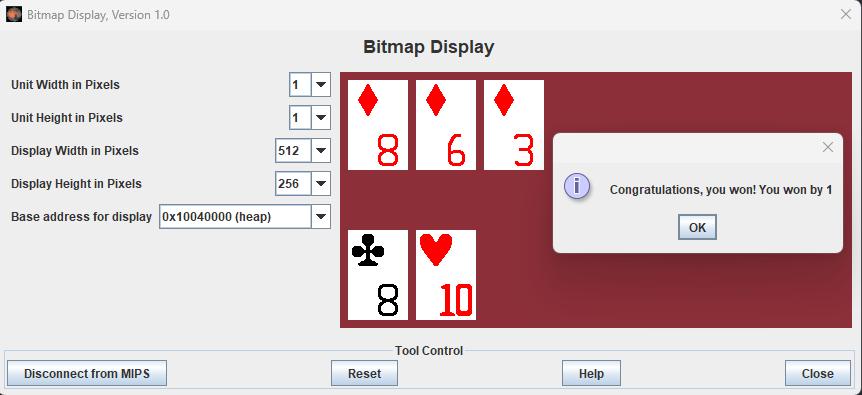
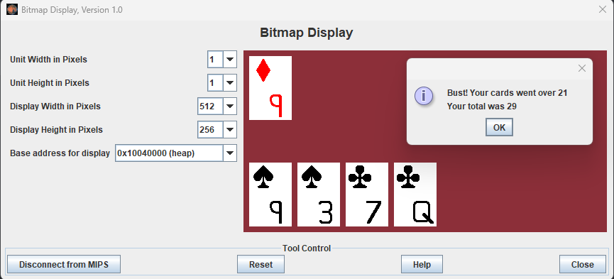
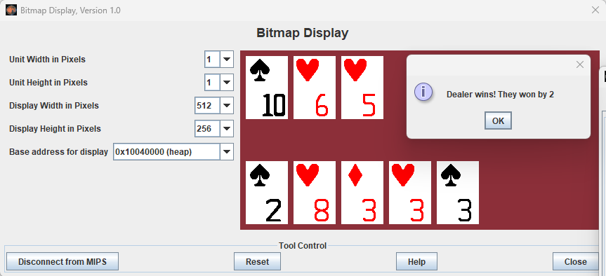

Samuel Preston <br>
SE 2340 Bitmap Project <br>
Dr.	Karen Mazidi

# How to run

To run this program, the follow settings must be used in MARS:
* Tools > Bitmap Display
    * Must be opened and connected to MIPS
    * Base address: ```0x10040000 (heap data)```
    * Width: ```512```
    * Height: ```256```
    * Unit Width: ```1```
    * Unit Height: ```1```
* Tools > Keyboard and Display MMIO Simulator
    * Must be opened and connected to MIPS

There is only one file required to use the program, ```program.asm```. Once it is loaded into MARS and the settings are configured correctly, pressing assemble and run will begin the game.

[Commands](#controls) are inputted as characters into the keyboard section of the *Keyboard and Display MMIO Simulator*. Your cards will appear at the bottom of the *Bitmap Display*, and the dealer's will appear at the top.

# Overview

This program hosts a simplified game of Blackjack. 

The player has the ability to play against a dealer (the program) over multiple rounds. The program uses a virtual deck, so card counting is possible and encouraged. The program will detect when the player or dealer busts as well as who won at the end of each round. Every card will appear visually on the screen, including their suits.

There are helpful features that make this program inviting to new players. At any time, the player can see their hand's numerical value, and they do not need to worry about competing with other people. Betting is available but completely optional, and if declined, will play no part in the game.

<div class="page"></div>

# How to play

The dealers cards will appear at the top of the screen, and yours will appear at the bottom. Your goal is to build a hand with a value greater than the dealer's but less than 21.

You determine your hand's value by totaling every card's value. 
The values are as follows:
* 2-10 are worth their face values (e.g. 3 is worth 3, and 5 is worth 5)
* Jacks, Queens, and Kings are all worth 10
* Aces can be worth either 1 or 11, whichever is more advantageous to the holder

You are dealt two cards at the beginning of the game, and the dealer is dealt one. If you are given an ace and a face card, you instantly win the round. Otherwise, you can draw a new card by *hitting*. This can be done any number of times, but if you draw a card that makes your hand's value exceed 21, you *bust* and lose the round. Once you are satisfied with your hand, you can *stand* to finish your turn.

When your turn is over, the dealer will draw a card. If their hand's value is at or below 16, they will draw again. If they go over 21, they bust and you automatically win. If they don't bust, whoever has the higher hand wins.

Betting is optional. Winning a round normally will double your bet, and winning with an initial ace and face card will 2.5x your bet. If you lose, you get nothing.

# Controls

Once the cards have been dealt, you can perform actions by typing a character in the *Keyboard and Display MMIO Simulator*:
* h - Hit (draw another card for your hand)
* s - Stand (keep your current hand and let the dealer draw)
* v - View Value (view your hand's current value)
* i - Info (display a tutorial dialog similar to this)
* e - Exit (quit the game)

<div class="page"></div>

# Main Loop Flowchart

This flowchart overviews the main game loop. Specific function definitions are defined in the following section.


<div class="page"></div>

# Functions Pseudocode


Every function used by the flowchart or defined in MIPS is recorded here.
All function calls formatted like ```function()``` represent calls to the other functions defined here.


### Deal Player
Deals a random card to the player
```
card = getRandomCard()
dealCard(player, card)
```

### Deal Dealer
Deals a random card to the dealer
```
card = getRandomCard()
dealCard(dealer, card)
```

<div class="page"></div>

### Deal Card
Deals a new card for either the player or dealer by displaying it on the screen.
Adds the card to the individual's total and marks if they have an ace.
* Arguments: ```Is dealer or player?```, ```card suit/rank```

```
card_value = getCardValue(card)

if dealer:
    count = read dealer card count from memory
    count++
    write card count back to memory

    value = read dealer card total value from memory
    value += card_value
    write card value back to memory

    if card rank is ace:
        set dealer has ace flag to true
else:
    count = read player card count from memory
    count++
    write card count back to memory

    value = read player card total value from memory
    value += card_value
    write card value back to memory
    
    if card rank is ace:
        set player has ace flag to true

if dealer:
    draw_location = top left + count * spacing
else:
    draw_location = bottom left + count * spacing

renderCard(card, draw_location)

```

<div class="page"></div>

### Draw Random Card
Chooses and removes a random card from the deck.
* Returns: ```card suit/rank```
```
card_count = searchDeck()
n = random int from 0 to card_count
card = searchDeck(n)

suit_bitstring = read card suit bitstring from memory
suit_bitstring -= 2 ^ card rank
write suit_bitstring back to memory

return card
```

### Search Deck
Iterates through the whole deck, either counting the total cards or looking for the Nth card.
* Arguments: ```-1``` or ```nth card```
* Returns: ```total card count``` or ```nth card suit/rank```
```
total = 0
for each suit bitstring:
    for each bit in suit bitstring:
        if bit is 1:
            total++
        if total equals nth card argument:
            return suit index, and bit index as rank
        shift bitstring right
return total
```

<div class="page"></div>

### Render Card
Renders a card on the screen including the suit and rank.
* Arguments: ```draw location```, ```card suit/rank```
```
drawRect(draw_location, CARD_WIDTH, CARD_HEIGHT, WHITE)

if suit is spade or club:
    color = black
else:
    color = red

sprite_address = suit root address + suit index
draw_sprite(draw_location, sprite_address, color)

sprite_address = rank root address + rank index
draw_location = bottom right of card
draw_sprite(draw_location, sprite_address, color)
```

### Render Rect
Renders a colored rectangle on screen.
* Arguments: ```draw location```, ```width```, ```height```, ```color```

```
for i in width:
    for j in height:
        store color at draw_location + i + j * screen width
```

### Render Sprite
Renders a sprite on the screen. 
Sprites are an array of words that include their dimensions and a long bitstring that will be iterated through. 
Every 1 in the bitstring represents a pixel that will be drawn while scanning left to right and down like a CRT.
* Arguments: ```draw location```, ```sprite address```, ```color```

```
width = read sprite width from sprite_address
height = read sprite height from sprite_address
bitstring = read sprite_address bitstring from memory
for i in width:
    for j in height:
        if the leftmost bit of bitstring is 1:
            store color at draw_location + i + j * screen width
        shift bitstring left
```

### Get Card Value
Returns the blackjack value of a card.
* Arguments: ```card rank```
* Returns: ```value int```

```
if card rank >= jack:
    return 10
else:
    return rank + 1
```

### Pop Card
Hides the rightmost card for either the player or dealer by drawing over the card with the background color. It also decrements the individual's card count.
* Arguments: ```dealer or player```
```
if dealer:
    card_count = read dealer card count from memory
    card_count--
    write new dealer card count to memory
    draw_location = top left + card_count * card spacing
else:
    card_count = read player card count from memory
    card_count--
    write new player card count to memory
    draw_location = bottom left + card_count * card spacing

drawRect(draw_location, CARD_WIDTH, CARD_HEIGHT, BACKGROUND_COLOR)
```

<div class="page"></div>

### Reset Game
Resets the game back to its default state to allow for another round.
The deck does not get reset unless it needs to be reshuffled. Every other game data value will be set to their default values.
```
card_count = read player card count from memory
for each card:
    popCard()
card_count = read dealer card count from memory
for each card:
    popCard()

write 0 to both card counts, ace flags, and card values

total_cards = searchDeck()
if total_cards < minimum deck size:
    syscall dialog to tell the user the deck is being reshuffled
    for each suit bitstring:
        write default suit bitstring value to memory
```

### Decide Winner
Decides which hand is winning and tells the user. 
It will automatically add 10 to their value if they have an ace since aces are already being counted as 1s.
```
player_value = read player value from memory
dealer_value = read dealer value from memory

player_ace = read if player has ace from memory
dealer_ace = read if dealer has ace from memory

if player has ace and player_value + 10 <= 21:
    player_value += 10
if dealer has ace and dealer_value + 10 <= 21:
    dealer_value += 10

if player_value > dealer_value:
    bet_enabled = read if betting is enabled from memory
    if bet_enabled:
        bet = read bet from memory
        bet *= default bet multiplier
        dialog syscall to tell the user they won the bet amount
    else:
        dialog syscall to tell the user they won by player_value - dealer_value
else if dealer_value > player_value:
    dialog syscall to tell the user they lost by dealer_value - player_value
else:
    dialog syscall to tell the user they tied
```

### Get Bet
Asks the user for a bet and stores it in memory.
```
do:
    bet = syscall to prompt the user for a bet amount (float)
while bet is NaN or bet < 0

if bet == null:
    bet = 0

write bet to memory
```

### Bet Confirm Dialog
Asks the user if they want to bet during this game and stores the decision in memory.
```
decision = syscall to prompt the user to answer yes or no
if decision == yes:
    store in memory that betting is enabled
else:
    store in memory that betting is disabled
```
<div class="page"></div>

# Screenshots

An example of an initial deal.


An example of a win for the player (no bet).



<div class="page"></div>

An example of typing (v) to view the value of your hand.


An example of busting.



<div class="page"></div>

An example of a loss for the player.



An example of what the keyboard inputs look like over a few rounds.


<div class="page"></div>

# How were the sprites created?

The sprites were created in GIMP, exported as PPM files, and parsed into the word-separated bitstrings using a python script.
The source for this script is as follows:
```python
#!/usr/bin/env python3

import sys
from textwrap import wrap

if len(sys.argv) < 2:
    print("Missing file argument")
    exit()

filepath = sys.argv[1]
with open(filepath) as file:

    def filter_func(x):
        # Ignore file type line and comments
        return not (x.startswith("P") or x.startswith("#"))

    lines = list(filter(filter_func, file.readlines()))

    # Get sprite dimensions
    width, height = map(int, lines.pop(0).split(" "))
    # Remove max value line
    lines.pop(0)

    line_count = len(lines)
    if line_count % 3 != 0:
        print("The number of color values is not divisible by 3.")
        exit()
    if line_count != width * height * 3:
        print(
            f"The number of pixel values doesn't match the dimensions. Expected {width * height * 3} values, got {line_count}."
        )
        exit()

    # Start with 1 extra word because otherwise leading 0s would be removed
    bit_num = 0xFFFFFFFF
    for i in range(0, line_count, 3):
        color = sum(map(int, lines[i : i + 3]))
        bit_num = bit_num << 1
        # Draw pixel if it's black
        if color == 0:
            bit_num += 1

    hex_string = f"{bit_num:x}"
    hex_vals = wrap(hex_string, 8)
    hex_vals[-1] = hex_vals[-1].ljust(8, "0")
    hex_vals.pop(0)  # Remove extra word
    print(width, height, *map(lambda x: f"0x{x}", hex_vals), sep=",")

```
